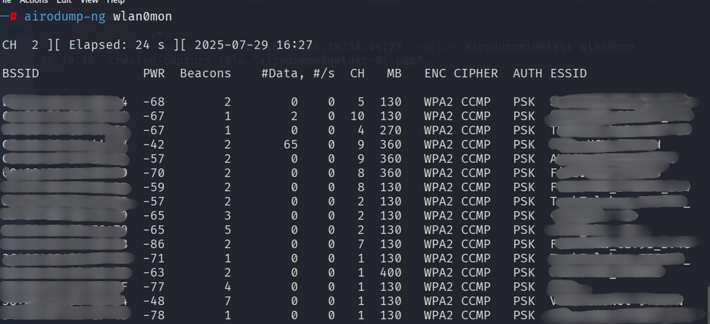

# Deauthentication (DeAuth) Attack on WPA2 Wi-Fi Networks (for educational)

> **Warning:** This was conducted only for the purpose of **cyber security training** and **testing in laboratory environments**. Unauthorized access to real networks is illegal and a crime. All operations must be performed on your own testing equipment. i did attack to my own wifi connection.

##  Requirements:
- Kali Linux
- `aircrack-ng`  ( `airodump-ng`, `aireplay-ng`)
-  `wifi card`  
---
## Managed Mode
This is the default mode for Wi-Fi devices. It allows you to connect to access points, send and receive your own traffic and it use internet and applications normally.
## Monitor Mode
This is a passive mode used in wireless security testing captures all nearby wireless packets, doesn’t connect to any access point and it useful for analyzing or attacking Wi-Fi networks.

## Switching Between Modes (Linux)
Use airmon-ng to toggle modes:
```bash
# Enable Monitor Mode
airmon-ng start wlan0
```
```bash
# Disable Monitor Mode (return to Managed)
airmon-ng stop wlan0mon
```

##  1. Scanning Networks (airodump-ng)
## airodump-ng
airodump-ng is a tool from the aircrack-ng suite used for: Capturing raw 802.11 wireless packets, scanning nearby Wi-Fi networks (APs), monitoring clients connected to those networks and capturing WPA/WPA2 handshakes. It’s essential for reconnaissance in wireless penetration testing.

 Scan All Nearby Networks
```bash
airodump-ng wlan0mon
```
 Focus on One Network
Capture only one target network's traffic:
```bash
airodump-ng —channel <channel> —bssid <bssid> —write <file_name> <interface> 
```
The moment when the surrounding networks are scanned below:


---

##  2. Selecting the Target Network

i did chose my own wifi as a target.
We only put this network and its connected clients under monitoring with the following command:

```bash
airodump-ng --channel 9 --bssid  <bssid> --write airodumptest wlan0mon
```

The moment the WPA handshake caught on:


---

##  3. Deauthentication Attack (aireplay-ng)
## aireplay-ng
aireplay-ng is a tool used for injecting packets into a wireless network.
It's commonly used to perform Wi-Fi attacks such as: Deauthentication attacks (forcing clients to disconnect), fake authentication (pretend to be a client), 
ARP request replay (generate traffic to speed up WEP cracking), Interactive packet injection. It’s most famous for sending deauth packets to capture WPA/WPA2 handshakes.

To capture the handshake, connected leaks must be disconnected from the network. The `aireplay-ng` script was implemented:
```bash
aireplay-ng --deauth 10 -a <BSSID> wlan0mon
```
This command disables printers connected to the target network (Access Point). This allows the handshake packet to be captured during reconnections.

The moment the DeAuth attack was sent:


---

## Notes
- This type of attack only works if there are **connected devices**.
- The appearance of `EAPOL` packets indicates that the WPA handshake was successfully received.
- The WPA handshake data can then be attempted to be cracked using tools such as `aircrack-ng` or `hashcat`.

---

## Recommendations
- Perform operations in virtual machines or physical test environments.
- Turn off background services with `airmon-ng check kill`.
- Only work on **allowed networks**.

---

